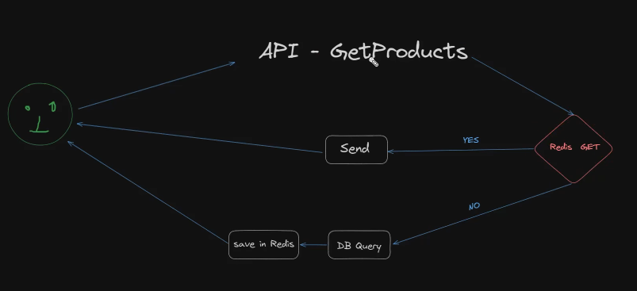

# Redis
- Redis is in memory database that means it stores the data in the ram which means it is faster as compared to mongodb or any other hard disk memory
- Redis is used for caching as well as memoization
## Caching VS Memoization
### Caching
- Purpose: Caching is a broader concept used to store and retrieve data that is expensive to generate or fetch. It's commonly used to speed up repeated access to the same data.
### Memoization

- Purpose: Memoization is a specific form of caching, primarily used to optimize the performance of functions by storing the results of expensive function calls.
## Using Redis for Caching and Memoization

### Caching with Redis

- Redis can be used as an efficient caching layer to store and retrieve data that is expensive to generate or fetch. This is particularly useful for web applications where data such as API responses or database queries can be cached to reduce latency and improve performance. A typical use case involves setting a TTL (Time To Live) for cached data to ensure it is periodically refreshed and remains up-to-date.

### Why Mongodb is prefered for main database over Redis
- Mongodb is cheaper but slower than redis
- Data which you store in mongodb is not volatile on the other hand redis is volatile

### For Example

- Lets say user first asks for 10 products, code will check the redis first whether it has the data of the 10 first products or not, If red have the data it will say yes and send the data to the user, And if not The request will be passed to the database
- Stale data :-  In redis database have to give the ttl while saving the data to the redis so old data doesnt remain in the redis and renews after a specific duration specified by the ttl 

